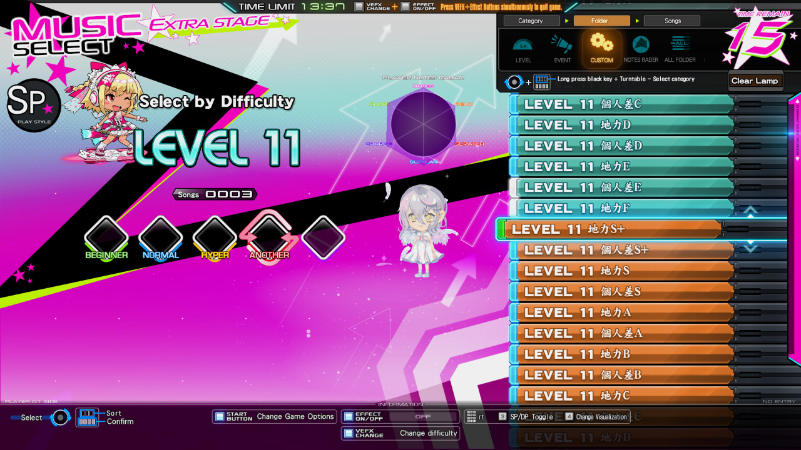

## playlister<sub>5</sub>
[](https://github.com/aixxe/playlister5/actions/workflows/Build-MSVC.yml)
[](https://github.com/aixxe/playlister5/actions/workflows/Build-LLVM.yml)
[](https://github.com/aixxe/playlister5/actions/workflows/Build-GCC.yml)

Enables creation of custom categories in beatmania IIDX

### Compatibility

The same `playlister.dll` file can be used across all supported games:

- beatmania IIDX 33 Sparkle Shower
- beatmania IIDX 32 Pinky Crush

## Install

> [!TIP]
> Custom bar textures are loaded from the `data/graphic/#/mselect.ifs` file. To make use of these, it is recommended to install [**IFS LayeredIFS**](https://github.com/mon/ifs_layeredfs/), as it can easily add and replace images without altering the original file

1. Download the latest release of **[playlister](https://github.com/aixxe/playlister5/releases)** and _optionally_ **[IFS LayeredFS](https://github.com/mon/ifs_layeredfs/releases)**

2. Extract `playlister.dll` and `ifs_hook.dll` to your game directory and update your launcher options:

#### [spice2x](https://spice2x.github.io)

```
spice64.exe [...] -k ifs_hook.dll -k playlister.dll
```

#### [Bemanitools](https://github.com/djhackersdev/bemanitools)

```
launcher.exe [...] -K ifs_hook.dll -K playlister.dll
```

3. Extract the `playlister` directory to the same directory as `playlister.dll`

## Troubleshooting

Ensure your logging level is set to _at least_ `info` in `prop/avs-config.xml` (or `-loglevel info` with spice2x)

If using Bemanitools, you may also want to use the `-Y log.txt` launcher option to write log contents to a file

Related messages should appear in the log file, for example:

```
[2026/06/27 08:17:52] I:playlister: playlister v5.0.0 (master@813c09f5) loaded at 0x2cad6200000
[2026/06/27 08:17:52] I:playlister: built Jun 27 2026 00:27:32 with Clang 22.1.8
[2026/06/27 08:17:52] I:playlister: running from directory 'D:\LDJ\contents\'
[2026/06/27 08:17:52] I:playlister: detected game library 'bm2dx.dll' at 0x180000000
[2026/06/27 08:17:52] I:playlister: loaded 000-sp-11-nc.yml (15 playlists)
[2026/06/27 08:17:52] I:playlister: loaded 001-sp-11-hc.yml (15 playlists)
[2026/06/27 08:17:52] I:playlister: loaded 002-sp-12-nc.yml (20 playlists)
[2026/06/27 08:17:52] I:playlister: loaded 003-sp-12-hc.yml (19 playlists)
[2026/06/27 08:17:52] I:playlister: loaded 004-sp-12-cpi-ec.yml (17 playlists)
[2026/06/27 08:17:52] I:playlister: loaded 005-sp-12-cpi-nc.yml (16 playlists)
[2026/06/27 08:17:52] I:playlister: loaded 006-sp-12-cpi-hc.yml (16 playlists)
[2026/06/27 08:17:52] I:playlister: loaded 007-sp-12-cpi-ex.yml (21 playlists)
[2026/06/27 08:17:52] I:playlister: loaded 008-sp-12-cpi-fc.yml (30 playlists)
[2026/06/27 08:17:52] I:playlister: loaded 009-dp-5-nc.yml (2 playlists)
[2026/06/27 08:17:52] I:playlister: loaded 010-dp-6-nc.yml (2 playlists)
[2026/06/27 08:17:52] I:playlister: loaded 011-dp-7-nc.yml (2 playlists)
[2026/06/27 08:17:52] I:playlister: loaded 012-dp-8-nc.yml (2 playlists)
[2026/06/27 08:17:52] I:playlister: loaded 013-dp-9-nc.yml (3 playlists)
[2026/06/27 08:17:52] I:playlister: loaded 014-dp-10-nc.yml (4 playlists)
[2026/06/27 08:17:52] I:playlister: loaded 015-dp-11-nc.yml (5 playlists)
[2026/06/27 08:17:52] I:playlister: loaded 016-dp-12-nc.yml (8 playlists)
[2026/06/27 08:17:52] I:playlister: total 197 playlists loaded from 17 files
[2026/06/27 08:17:52] I:playlister: initialized successfully in 0.24 seconds
```

Set the log level to `misc` for even more detailed messages, e.g.

```
[2026/06/27 08:17:52] M:playlister: found vector insert function at 0x180656190
[2026/06/27 08:17:52] M:playlister: found clear lamp getter function at 0x18087aa20
[2026/06/27 08:17:52] M:playlister: found bar text render check at 0x1805e7a9d
[2026/06/27 08:17:52] M:playlister: found bar text render call at 0x1805e7d15
[2026/06/27 08:17:52] M:playlister: found group populate function at 0x180656450
[2026/06/27 08:17:52] M:playlister: found category definition getter at 0x18087a4c0
[2026/06/27 08:17:52] M:playlister: found folder voice play function at 0x18087ecd0
[2026/06/27 08:17:52] M:playlister: found music select initialize function at 0x1805f4830
[2026/06/27 08:17:52] M:playlister: found bar badge accessor functions at:
[2026/06/27 08:17:52] M:playlister:   - weekly     => 0x18087b370
[2026/06/27 08:17:52] M:playlister:   - tournament => 0x18087b220
[2026/06/27 08:17:52] M:playlister:   - kac        => 0x18087abf0
[2026/06/27 08:17:52] M:playlister:   - featured   => 0x18087ad40
[2026/06/27 08:17:52] M:playlister: found category initialize function at 0x1805eda90
[2026/06/27 08:17:52] M:playlister: found music entry getter function at 0x18096a3f0
[2026/06/27 08:17:52] M:playlister: found bar chart insertion function at 0x180879870
[2026/06/27 08:17:52] M:playlister: found score data getter function at 0x180599090
[2026/06/27 08:17:52] M:playlister: parsed 463 system sounds from table
```

When reporting issues, use the `misc` log level for additional verbose messages